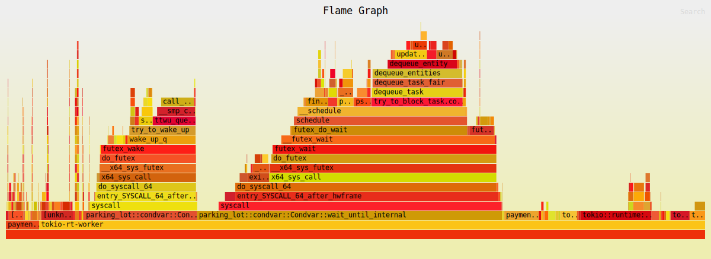
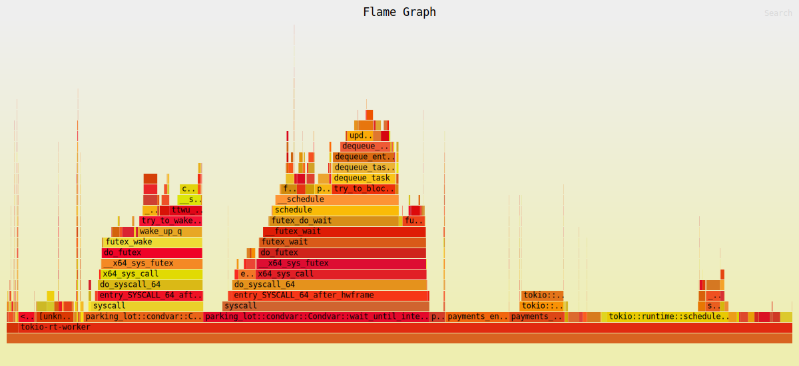

# Payments Engine

A Rust payments engine that reads transactions from CSV, processes account state transitions, and writes final account balances as CSV.

This project follows the take-home specification for processing:

- `deposit`
- `withdrawal`
- `dispute`
- `resolve`
- `chargeback`

## Run

Build:

```bash
cargo build --release
```

Run against an input CSV:

```bash
cargo run -- transactions.csv > accounts.csv
```

The input file path is the first and only CLI argument.

## Input format

Expected header:

```csv
type,client,tx,amount
```

Where:

- `type`: one of `deposit`, `withdrawal`, `dispute`, `resolve`, `chargeback`
- `client`: `u16`
- `tx`: `u32` (globally unique id for create transactions)
- `amount`: decimal with up to 4 fractional digits (required for deposit/withdrawal)

## Output format

CSV written to stdout with header:

```csv
client,available,held,total,locked
```

Row order is not guaranteed.

## Behavior summary

- **Deposit**: increases `available` and `total`
- **Withdrawal**: decreases `available` and `total` if sufficient available funds exist
- **Dispute**: moves referenced deposit amount from `available` to `held`
- **Resolve**: moves disputed amount from `held` back to `available`
- **Chargeback**: removes disputed amount from `held` and `total`, and locks the account

Invalid operations are ignored (for example: missing referenced tx, wrong lifecycle transition, locked account operations).

## Design notes

- Uses fixed-point arithmetic (`Amount`) with scale `10_000` (4 decimal places).
- Uses per-client account state with:
  - balances (`available`, `held`, `total`, `locked`)
  - tracked deposits (`tx -> amount`) for dispute references
  - open disputes (`tx -> amount`)
- Uses a multi-worker processing model:
  - transactions are routed by `client_id % worker_count`
  - all transactions for one client stay on the same worker
- Global duplicate filtering is applied to create transactions (`deposit`/`withdrawal`) using tx id.

## Data structure backend switching

The project supports two map/set backends:

- default: `hashbrown`
- optional: std collections

Default build:

```bash
cargo build
```

Use std backend:

```bash
cargo build --no-default-features --features std-collections
```

## Testing

Run all tests:

```bash
cargo test
```

Unit tests cover core account logic, tx processor transitions, tx engine duplicate filtering and end-to-end source processing, CSV row parsing, report formatting, and in-memory account storage behavior.

There is also an end-to-end test in `lib.rs` that runs the full pipeline from CSV input to final account state assertions. In a production setup this would typically be part of CI gates (together with coverage/perf checks) to catch regressions across module boundaries.

## Coverage

If `cargo-llvm-cov` is installed:

```bash
cargo llvm-cov --workspace --summary-only
```

Generate HTML report:

```bash
cargo llvm-cov --workspace --html
```

Open:

`target/llvm-cov/html/index.html`

Latest local summary:

```text
Filename                         Regions    Missed Regions     Cover   Functions  Missed Functions  Executed       Lines      Missed Lines     Cover    Branches   Missed Branches     Cover
--------------------------------------------------------------------------------------------------------------------------------------------------------------------------------------------
core/account.rs                      184                 8    95.65%          11                 0   100.00%         119                12    89.92%           0                 0         -
core/tx_engine.rs                    186                 6    96.77%          21                 0   100.00%         137                 2    98.54%           0                 0         -
core/tx_processor.rs                 242                19    92.15%          14                 0   100.00%         137                15    89.05%           0                 0         -
core/types.rs                         41                 6    85.37%           8                 2    75.00%          36                 6    83.33%           0                 0         -
lib.rs                                81                 3    96.30%           5                 0   100.00%          51                 0   100.00%           0                 0         -
main.rs                               14                14     0.00%           2                 2     0.00%           8                 8     0.00%           0                 0         -
report/sink.rs                       101                 3    97.03%           8                 0   100.00%          66                 0   100.00%           0                 0         -
source/csv.rs                         32                 7    78.12%           4                 1    75.00%          27                 7    74.07%           0                 0         -
source/types.rs                       77                 5    93.51%           5                 1    80.00%          46                 5    89.13%           0                 0         -
storage/in_memory_account.rs          56                 0   100.00%           6                 0   100.00%          38                 0   100.00%           0                 0         -
--------------------------------------------------------------------------------------------------------------------------------------------------------------------------------------------
TOTAL                               1014                71    93.00%          84                 6    92.86%         665                55    91.73%           0                 0         -
```

## Assumptions and Tradeoffs

### Assumptions

- Assumed that tx_ids are unique for create transactions based on the spec, so I don't keep a global duplicate filter in the hot path now. I had a HashSet at engine level initially (and in prod I would consider a hybrid BloomFilter + HashSet approach if needed), but after flamegraphs I removed it to squeeze some performance.
- Run against big and small datasets: small to build initial functionality quickly, big to test flamegraphs and throughput. Small dataset is included in the repo in `transactions.csv`.
- Assumed that a dispute can exist only for a deposit and not for a withdrawal.
- Assumed that there's no need for full transaction log for this assignment, even though on such system every transaction should be recorded as an immutable log (event-sourcing) with sequence numbers so that the system can recover deterministically from failures and support stronger auditing.
- Assumed that with 4 digits max and dealing with amounts that are in a currency that we know ahead, it was safe to switch to scaled i64 to accelerate math ops. However in a prod case scenario, this is a serious assumption and we had to be sure that no edge cases or surprises would appear from potential providers.
- Assumed invalid lifecycle operations are ignored (missing referenced tx, invalid transition, operations on locked account), matching the assignment guidance.
- Assumed that in a normal production-critical setup, criterion benchmarks should be added to evaluate data-structure selection, deserialization approaches, and numerical operation types (`Decimal` vs scaled `i64`). For simplicity and assignment focus, these benchmark suites are not included here.
- Assumed that separating `lib.rs` and `main.rs` is useful for testability, especially to make end-to-end testing setup straightforward without coupling tests to CLI entrypoint details.
- Assumed that using `tracing` is more appropriate than plain logging for a Tokio-based project, especially if richer async-aware instrumentation is needed. For simplicity this project could also have used regular logging.
- Assumed that logging should stay disabled by default so CLI input/output behavior remains clean. To enable logging, uncomment the `tracing_subscriber` initialization lines in `src/main.rs`.
- Assumed that `eyre` is preferred over `anyhow` here as a more production-oriented error reporting choice due to richer diagnostics/context support, even though `anyhow` would have worked fine for this assignment as well.
- Assumed that keeping explicit `eyre::Result` in signatures (instead of importing `Result`) improves readability and avoids confusion with the standard library `Result` in review.
- Assumed that more advanced micro-optimization crates (e.g. `itoa` for formatting, `SmolStr` or `Ustr` for string-heavy/static-string scenarios) were intentionally avoided to keep the implementation simpler. If throughput becomes first-class at larger scale, benchmarking these alternatives would be beneficial.

### Tradeoffs

- For the building blocks of the application, certain trade-offs were made. `hashbrown` HashMap crate was used instead of std one on the assumption that it could help performance for simple integer keys. Especially for accounts, a faster solution would potentially be an indexed vector (more memory) or a more complicated hybrid data struct (partitioned keys with fixed buffers under the hood, or crates similar to https://docs.rs/identity-hash/latest/identity_hash/). Optimizing very low-level cache efficiency didn't seem like a must for this assignment, so a higher-level hashmap approach was followed overall. Also, an easy switch between HashMap implementations was added (two mutually-exclusive feature flags: `hashbrown-collections` as default and `std-collections`).
- Assuming we could parallelize transaction processing across different accounts (similar idea to parallel account execution in chains like Solana/Sui), a parallel solution was implemented by routing each transaction with modulo to a processor task. This comes with trade-offs as a single-threaded approach might still perform better depending on compute vs I/O bound profile. For these simple math ops, flamegraphs showed that a good chunk of time is still spent orchestrating Tokio runtime behavior. After reducing workers, increasing mpsc buffer, and removing duplicate tx filter from engine, useful work increased from ~4.9% to ~8.1%.
- On data deserialization, we could potentially test faster string-to-i64 and i64-to-string serializers/deserializers for efficiency. For now `Decimal` is kept as a consistent high-level approach for input/output formatting, while we convert internally to scaled `i64` for math ops.
- The source is responsible for filtering anything that can't be deserialized or is invalid data-wise (e.g. unable to deserialize from Decimal to i64). This gives slightly less transparency/control over these failures at engine level, but this trade-off was made to keep the pipeline simpler.
- The engine uses a generic state type pattern (`TxEngine<A, Uninitialized/Initialized>`). The value of this pattern for a project of this size is debatable, but it is included intentionally as a demonstration of type-state initialization guarantees and compile-time flow constraints.
- Output row order is intentionally not forced/sorted. Sorting would help deterministic diffs and reproducibility but adds extra cost and was not required by the assignment.
- Keeping account-level deposits/open_disputes fully in-memory keeps processing straightforward and fast per operation, but memory usage can grow with larger datasets.
- Increasing mpsc buffer size reduced orchestration overhead in profiling, but this trades lower scheduling pressure for higher peak memory usage.
- Ignoring invalid operations keeps the pipeline robust and aligned with spec, but in production this should typically be paired with explicit counters/metrics for observability.
- Test suite is strong on unit/e2e correctness and quick feedback, but high-volume perf regressions are currently validated manually via perf/flamegraph runs rather than automated perf gates.

## Flamegraph comparison

### Baseline run (`flamegraph_128_buffer_15_workers.svg`)

Setup differences:

- mpsc channel buffer: `128`
- worker count: `15`
- engine-level duplicate create-tx filter: enabled

Artifact:

- `flamegraph_128_buffer_15_workers.svg`

Preview:



### Updated run (`flamegraph_4096_buffer_no_dup_filter_8_workers.svg`)

Setup differences:

- mpsc channel buffer: `4096`
- worker count: `8`
- engine-level duplicate create-tx filter: removed

Artifact:

- `flamegraph_4096_buffer_no_dup_filter_8_workers.svg`

Preview:


